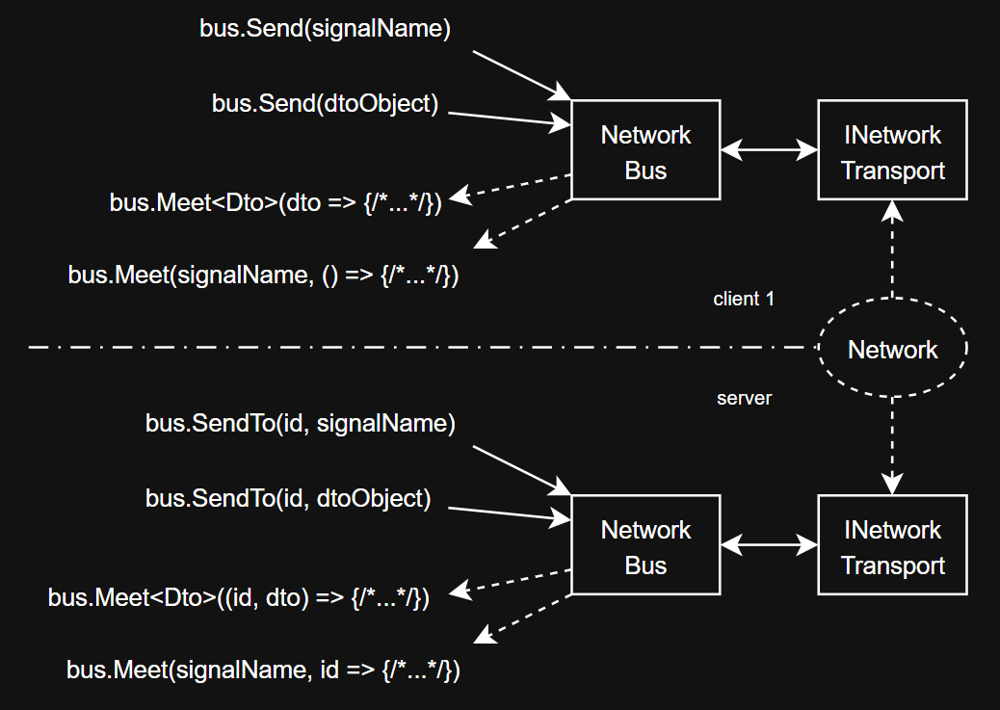

# Network Event Bus

A simple C# library to simplify interaction between members of the same network. In fact, this is just an Event Bus pattern, but it implies that the participants are in different processes.

  

The library does not assume the responsibility of transmitting network packets, but delegates this task to a class implementing the `INetworkTransport` interface.
This abstraction makes it possible to use any network transmission library convenient for the project (with any protocol).
But it requires writing a class that will be a bridge between NetworkBus and your network library.

## Features
+ Sending and waiting for signals (the signal has a name, but does not contain data);
+ Sending and waiting for an object of the required type to be received.

## Current implementation
Reflection is used in dispatching. Transmission objects are serialized in JSON format and transmitted to `INetworkTransport` as strings.

There are two types of Bus in this project:
+ for the client, he does not know how to identify other participants. It is suitable for interacting with only one network member (client or server);
+ for the server – identifies network participants and allows you to send data to someone specifically or all at once.

Server implementations:
+ `ActiveBus` – when the data sending method is called, it is sent immediately;
+ `PassiveBus` – when calling the send method, data is added to the buffer, but actual sending occurs only when calling the `Release()` method.

